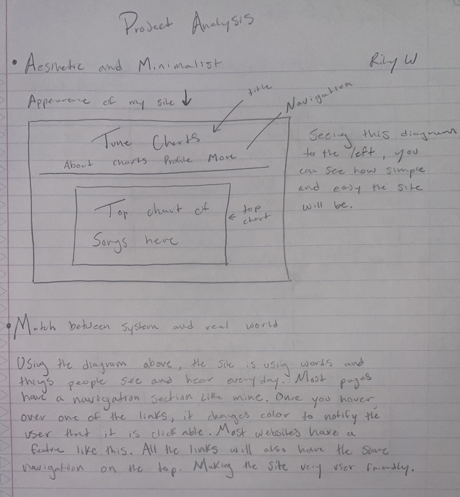
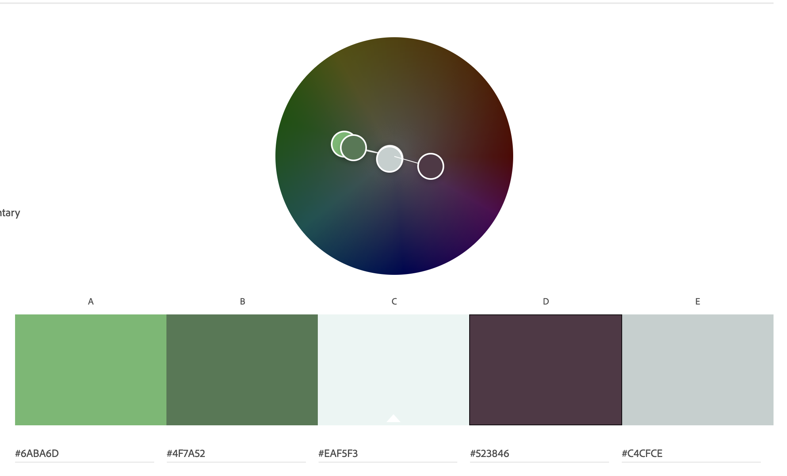

## Aesthetic and Minimalist Design ##
##### ------------- #####
Using a aesthetic and minimalist design would increase the usability and appearance of my webite.
Keeping this in mind, being able to project the correct amount of information to keep this a
'minimalist' website will be the challenge. I don't want to overwhelm the user with unnescessary 
information. Keeping the website apperance clean and concise to follow this heurisitc. 
Following this heuristic will also make my website visually appealing to the user.
##### ------------- #####

## Match between System and the Real World ##
##### ------------- #####
Having this heuristic in mind, being able to use the right appearance and words on the website is vital.
Any user who would access this site, should be able to use knowledge from previous websites to navigate 
through it. Also, since I have the other heuristic about a minimalist design. That will help with 
the overall navigation of the site. The site I will be making, is going to be on the more minimalist side of
websites. I'm sure people have been to more complicated websites than mine. Also, using words and phrases
that people have seen before will help with matching it to the real world. Using words that people don't 
understand would just hinder the usability of my site.
##### ------------- #####

## Diagram / Sketch ##
######  ######

## Color Palette ##
##### ------------- #####
In the picture below, you can see the color values I gave selected for the website. I already have the cream color applied to the webiste. I chose the other colors because forest green is my favorite color. I believe it is very pleasing to the eye. The other maroon color is complementary to the green. They go well together. The lighter green is to contrast against the darker green. And lastly, the white is just an essential color that every website should utilize.
##### ------------- #####

## Color Image ##
######  ######

## Typography ##
##### ------------- #####
The typography that I chose is very minimalist and modern. The name of the font is called "Montserrat". It's a free font from google. I import this on every webpage to keep the same theme throughout the whole website. This will be the only font I will be using as well. I'm doing this because I believe it provides the website with consistent theme. In the headers and titles, I will most likely bold the font to make it stand out on the page. But the rest of the page will be the regular font.
##### ------------- #####