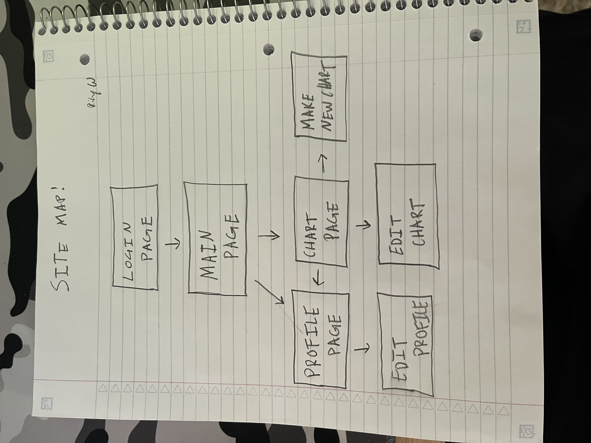
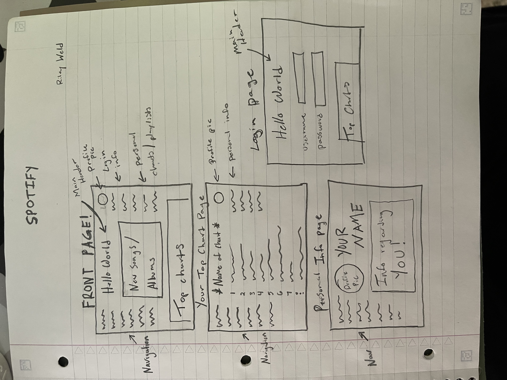

# Tune Charts #

---------------
Have you ever wanted a website that lets you create charts of your 
favorite songs? Tune Charts lets you do this, but even better. Soon we 
will be adding implementation to view friends charts. But for now, enjoy 
making personalized charts based on moods, times, and places. If you want 
a chart for your top gym songs, you can do that here. When your chilling 
at home and want to show off your top mellow songs, you can make a chart 
for it. With your personalized login, you will have access to however many 
charts you want to make. You can edit these charts or make new ones. This 
also allows you to delete charts if you arent feeling them anymore. We 
have also set up a profile page to let you show of your all time favorites 
to whomever views it.
---------------

## Web service ##
### [Spotify](https://developer.spotify.com/documentation/web-api/) ###
OAuth 2.0 ###

### - Base Url for all web api requests = [HERE](https://api.spotify.com/v1) ###

---------------
## Database Use ##
### Some of the data I'm going to need to read from will be the spotify 
database. I'm going to need songs, albums and artists from them. I'm going 
to need to write to my own database with the information regarding a users 
login information, along with the information in their account. This would 
be the charts they make and their profile page. The relationship between 
the tables depends on how I set up the website. The user is going to be 
able to access different tables depending on where they are in the 
website. Obviously you can only access a certain table if your in the 
right spot. For example, you can't get to the chart page unless you logged 
in and got to the main page. I'm going to need 3 tables. The personal 
login table, personal information table, and the chart table.  ###

---------------
## Initial designs ##
######   ######
